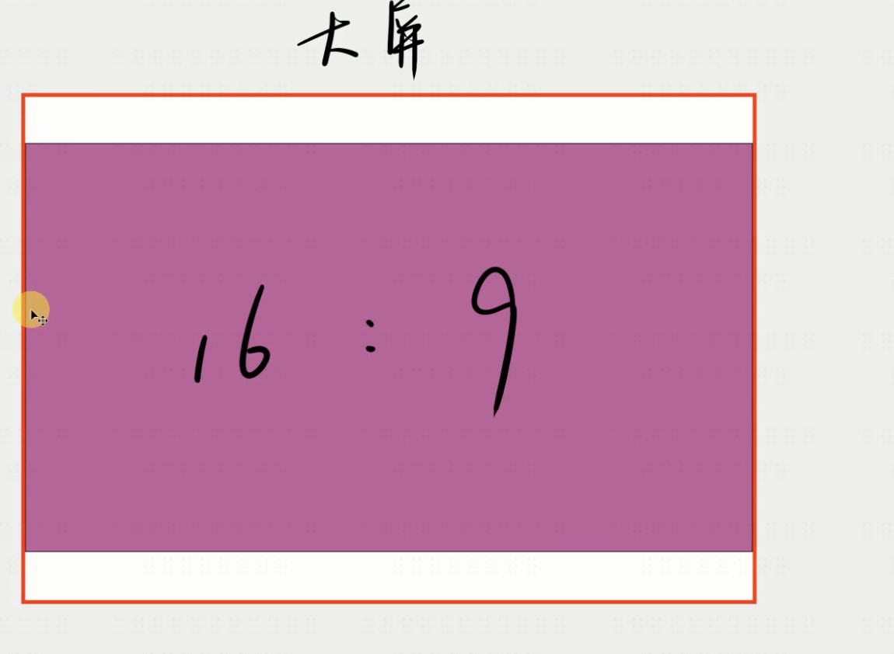
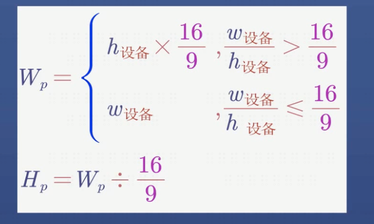
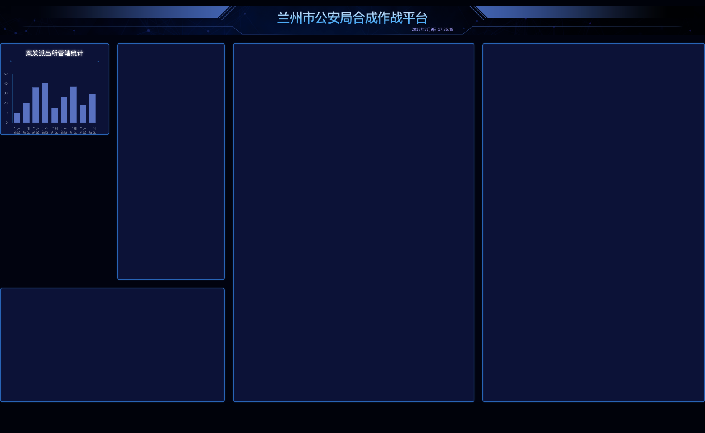

# 大屏幕项目展示

> 这个项目很适合小白学习下怎么来创建一个大屏幕项目，以及一些思路，比如框高占比怎么做，尺寸大小的适配怎么做

## 大屏幕素材寻找
modao/chandao 这种产品网站很多

## 大屏幕适配的公式
正常的电脑的屏幕尺寸都在16:9这种宽高比范围内

* 当客户的设备的尺寸 > (16/9) [更宽] 说明我们展示的内容应该左右居中， 展示内容的宽度应该是**设备高度**/(16/9)
* 当客户的设备尺寸 < (16/9) [更高] 说明我们展示的内容应该上下居中， 展示内容的宽度应该是**设备高度**

做了一个简单的demo,因为没用sass,算rem的方式不可取，只是展示出代码思路
展示效果

